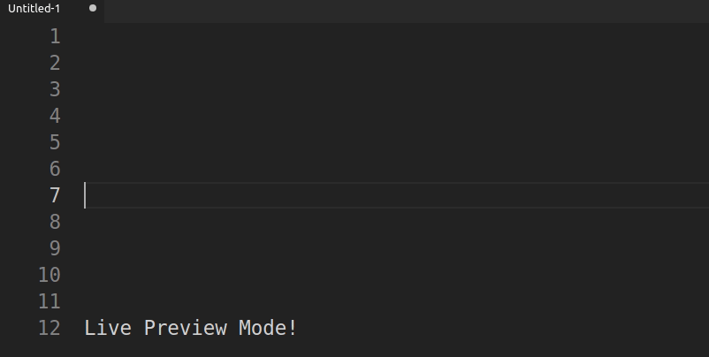
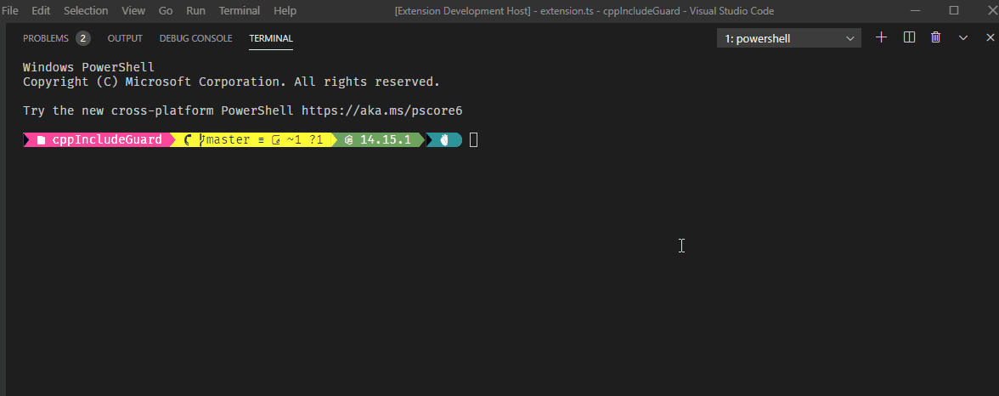
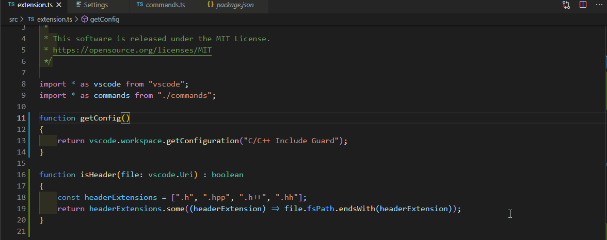
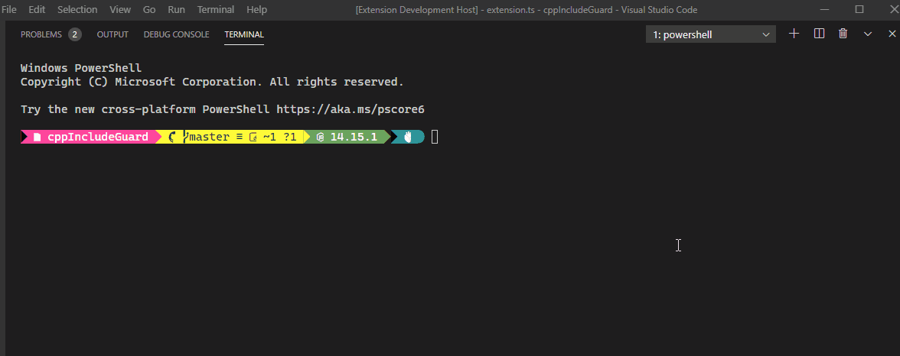
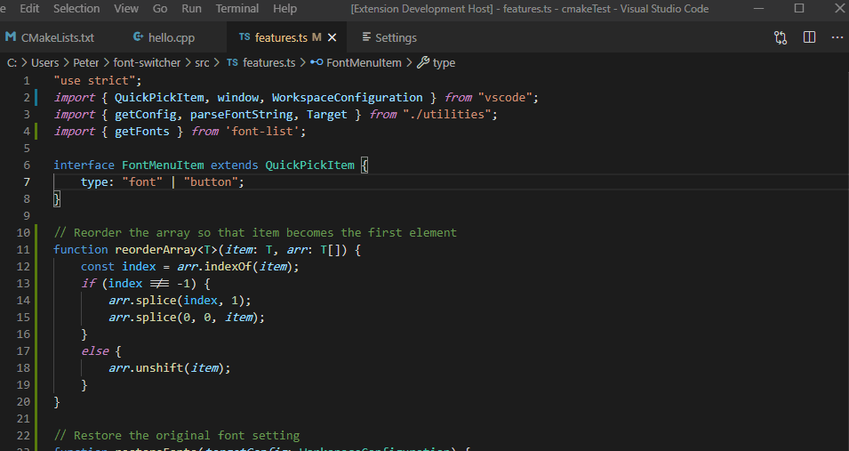

# Font Switcher

 Font Switcher allows you to quickly configure your font settings from the command palette.

## Features

- Add / remove / reorder editor and terminal fonts.
    - Modifies the `editor.fontFamily` and `terminal.integrated.fontFamily` settings respectively.
- Adjust size of editor and terminal fonts.
    - Modifies the `editor.fontSize` and `terminal.integrated.fontSize` respectively.

## Commands

### > Switch Font

### > Switch Terminal Font

### > Font Size

### > Terminal Font Size

### > Preview and add all system fonts

## Extension Commands

This extension contributes the following commands:

- `font-switcher.switchFont`: Show a quickPick menu of the user defined editor font families.
- `font-switcher.setFontSize`: Show an input dialog for setting the font size
- `font-switcher.switchTerminalFont`: Show a quickPick menu of the user defined integrated terminal font families
- `font-switcher.setTerminalFontSize`: Show an input dialog for setting the terminal font size